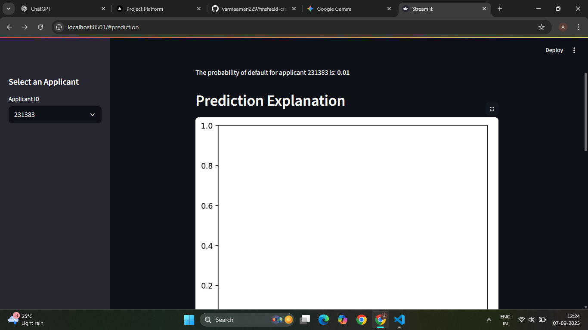
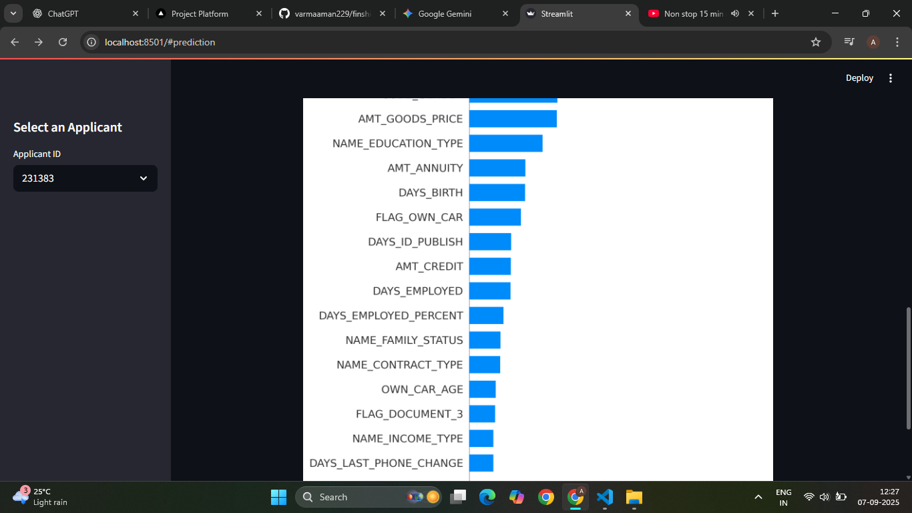

# Advanced Credit Risk Management and Ethical Defaulter Intelligence

This project provides a solution for a credit risk management hackathon. It includes a machine learning model to predict the probability of default and an ethical framework for post-default intelligence.

## Project Structure

-   **data/**: Contains the raw and processed datasets.
-   **notebooks/**: Jupyter notebooks for exploratory data analysis.
-   **src/**: Source code for data preprocessing, model training, evaluation, and post-default intelligence.
-   **app.py**: A Streamlit application to demonstrate the model's predictions and explanations.
-   **.gitignore**: Specifies files to be ignored by Git.
-   **README.md**: This file.
-   **requirements.txt**: A list of Python libraries required to run the project.

## Setup and Execution

1.  **Clone the repository:**
    ```bash
    git clone [https://github.com/your-username/credit-risk-hackathon.git](https://github.com/your-username/credit-risk-hackathon.git)
    cd credit-risk-hackathon
    ```

2.  **Create and activate a virtual environment:**
    ```bash
    python -m venv venv
    source venv/bin/activate  # On Windows, use `venv\Scripts\activate`
    ```

3.  **Install the required libraries:**
    ```bash
    pip install -r requirements.txt
    ```

4.  **Run the Streamlit application:**
    ```bash
    streamlit run app.py
    ```

## Solution Overview

### Predictive Modeling

The core of the solution is a predictive model that calculates the **Probability of Default (PD)**. The model is trained on a combination of traditional credit bureau data and alternative data sources to provide a more accurate and inclusive assessment of credit risk.

### Post-Default Intelligence

The project also includes a framework for **Ethical Contact Verification**, which reframes the "search and tracking" of defaulters as a professional and compliant intelligence-gathering process. This framework is designed to be fully compliant with regulatory guidelines, such as those from the Reserve Bank of India (RBI).

